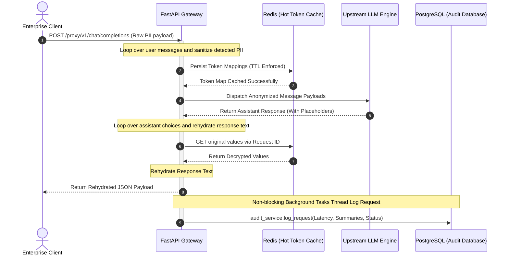

# PII Secure Guardrail Proxy

A high-performance, low-latency Data Loss Prevention (DLP) API Gateway engineered to intercept, sanitize, and manage Personally Identifiable Information (PII) flowing between enterprise clients and Large Language Models (LLMs).

Built on top of **FastAPI**, **Pydantic v2**, and **Microsoft Presidio**, the proxy enforces data sovereignty and compliance rules by stripping sensitive tokens on the outbound path, caching secure mapping topologies in **Redis**, and symmetrically reconstructing payloads on the inbound response path.

---

## 🏗️ Core Architecture & Execution Flow

The proxy executes a tight, synchronous request-response sanitization lifecycle combined with non-blocking, asynchronous telemetry logging to maintain an ultra-low latency ceiling:

1. **Inbound Extraction & Sanitization:** Iterates over inbound `ChatCompletionRequest` payloads, isolating user messages. The `sanitization_service` scans text for PII entities, maps them to anonymized Presidio placeholders, and aggregates token tracking metadata.
2. **Reverse Mapping (Hot Cache Storage):** Token mappings are stored temporarily in a hot **Redis** cache tier using strict `TOKEN_TTL` rules.
3. **Upstream Execution & Interception:** The sanitized payload is evaluated against the upstream model configuration. The generated assistant response contains placeholder sequences instead of raw credentials.
4. **Symmetric Payload Rehydration:** Loops through assistant choices, scanning the output text to map the placeholder keys back to their original sensitive values using hot lookups from Redis.
5. **Decoupled Audit Hand-Off:** Computes total execution latency (`latency_ms`) and dispatches anonymized metadata summaries to a background worker thread to register permanent auditing histories in **PostgreSQL**.

---

## 📊 Architectural Topology

### Request/Response Guardrail Lifecycle



---

## 🛠️ Technology Stack

* **Framework Core:** Python `>=3.13` | FastAPI
* **Validation & Type-Safety:** Pydantic v2 | Pydantic Settings
* **DLP Processing Engines:** Microsoft Presidio Analyzer & Anonymizer
* **Hot Caching Subtier:** Redis Server (High-throughput storage for request-response state lookups)
* **Persistent Analytics Database:** PostgreSQL Engine (Saves anonymized audit log schemas)
* **Package Management Engine:** `uv` (Fast dependency resolution tool)

---

## 🚀 Workspace Setup & Verification

This project leverages the **`uv` workspace manager** for ultra-fast dependency tracking and explicit environment orchestration.

### 1. Synchronize Dependencies

Clone your codebase and execute `uv sync` to compile the isolated virtual environment:

```bash
git clone <your-repository-url>
cd pii-secure-guardrail-proxy

# Build virtual environment and sync exact pinned locking structures
uv venv
uv sync

```

### 2. Download Core spaCy Language Models

The underlying Microsoft Presidio Analyzer engine requires targeted spaCy models to compute accurate Name Entity Recognition (NER) tokens:

```bash
uv run python -m spacy download en_core_web_sm

```

### 3. Spin Up Infrastructure Topologies

Launch ephemeral container architectures to satisfy the local infrastructure footprint using standard Docker configurations:

```bash
# Run local Redis caching image
docker run -d --name pii-cache-tier -p 6379:6379 redis:alpine

# Run local PostgreSQL data engine
docker run -d --name pii-audit-db -e POSTGRES_USER=postgres -e POSTGRES_PASSWORD=local_secure_password -e POSTGRES_DB=pii_audit_ledger -p 5432:5432 postgres:alpine

```

### 4. Fire Up the Proxy Gateway Server

Spin up your server workspace natively via the configured `main.py` entry point:

```bash
uv run python main.py

```

---

## 🔌 API Verification Traces

### Health Checks

Validate the configuration modules and runtime stability profiles:

```bash
curl -X GET http://localhost:8000/health

```

**Response Output:**

```json
{
  "status": "healthy",
  "project": "PII Secure Guardrail Proxy",
  "version": "0.1.0"
}

```

### Guarded Completions Route Execution

Submit structured data arrays directly through the proxy router:

```bash
curl -X POST http://localhost:8000/proxy/v1/chat/completions \
  -H "Content-Type: application/json" \
  -d '{
    "model": "gpt-4o",
    "messages": [
      {
        "role": "user",
        "content": "My private email address is user@example.com."
      }
    ]
  }'

```

#### Middleware Processing States

1. **Outbound State Post-Sanitization:** `"My private email address is <EMAIL_ADDRESS>."`
2. **Inbound Trace Received From LLM Engine:** `"I received your request. The PII you mentioned has been tokenized. One of the tokens is <EMAIL_ADDRESS>."`
3. **Rehydrated Final Response Output Delivered to Client:** See payload structure below.

**Resulting Gateway Delivery:**

```json
{
  "choices": [
    {
      "message": {
        "role": "assistant",
        "content": "I received your request. The PII you mentioned has been tokenized. One of the tokens is user@example.com."
      }
    ]
  }
}

```

This markdown precisely mirrors your exact code layers, including `main.py`'s launch pattern and the conditional structure inside your custom mock loop. It's a clean plug-and-play profile piece. What file or module are we building or tuning next?

```
